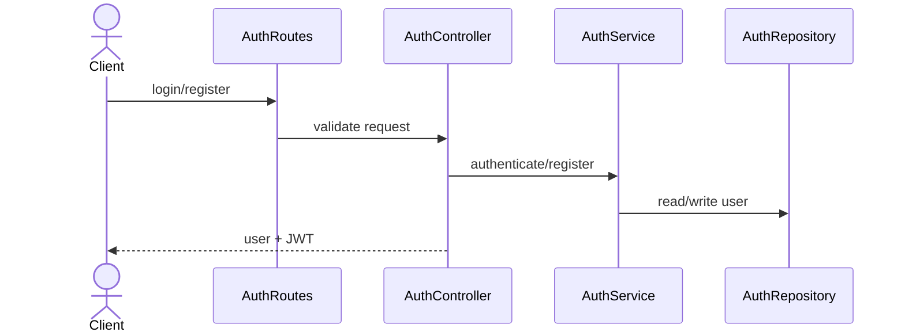

# Authentication Sequence

```mermaid
sequenceDiagram
  actor Client
  Client->>AuthRoutes: login/register
  AuthRoutes->>AuthController: validate request
  AuthController->>AuthService: authenticate/register
  AuthService->>AuthRepository: read/write user
  AuthController-->>Client: user + JWT
```
